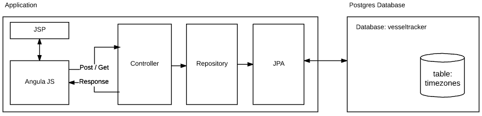
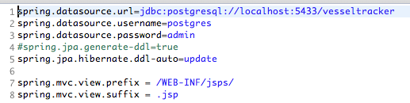
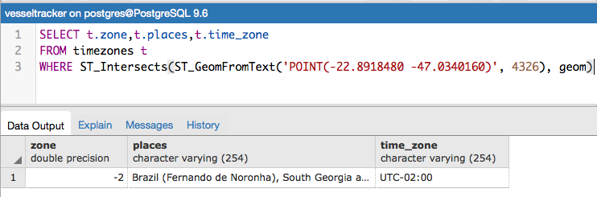
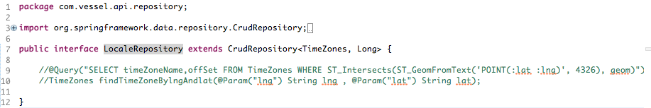
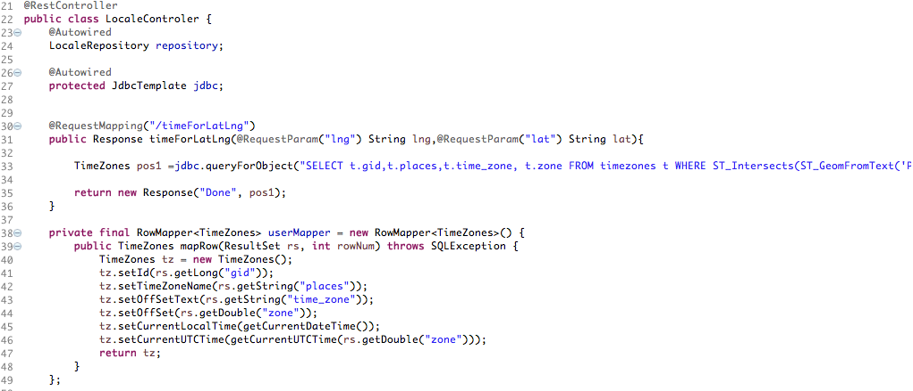
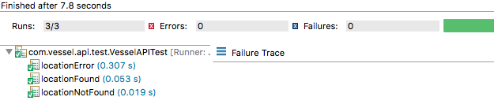
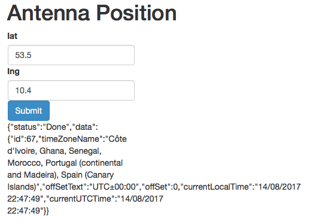
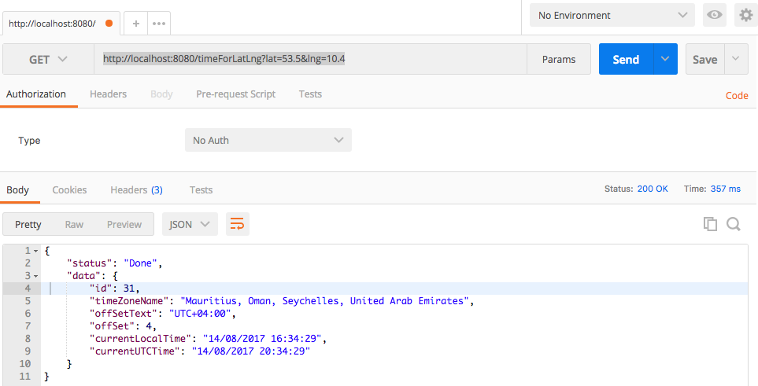

# VesselAPI

VesselAPi project has the main focus to provide an webservice that returns the name of the timezone and the current local time for any given lon and lat.
# Requirements considered
- The timezone information needs to be stored in a postgresql/postgis
database. The timezones are stored as polygons and for each time zone
there is some additional information (name, UTC offset etc.)

- The Application runs standalone using the Spring Boot Framework

Spring Boot
http://projects.spring.io/spring-boot/

Spring Data REST 
http://projects.spring.io/spring-data-rest/
http://projects.spring.io/spring-data/

AngularJS
https://angularjs.org/

PostgreSQL
http://www.postgresql.org/

PostGis - Install with App http://www.bostongis.com/PrinterFriendly.aspx?content_name=postgis_tut01

# Architecture

 


database application properties connection

 

## API returns

1) Sucessful - when the user informs a valid lgn & lat

```sh
{
    "status": "Done",
    "data": {
        "id": 67,
        "timeZoneName": "Côte d'Ivoire, Ghana, Senegal, Morocco, Portugal (continental and Madeira), Spain (Canary Islands)",
        "offSetText": "UTC±00:00",
        "offSet": 0,
        "currentLocalTime": "15/08/2017 11:36:55",
        "currentUTCTime": "15/08/2017 11:36:55"
    }
}
```

2) Not Found -  when the user informs a valid lgn & lat but doens't exists

```sh
{
    "status": "Not Found",
    "data": {
        "id": null,
        "timeZoneName": null,
        "offSetText": null,
        "offSet": null,
        "currentLocalTime": null,
        "currentUTCTime": null
    }
}
```

2) Not Found -  when the user informs an invalid lgn & lat

```sh
{
    "status": "Fail",
    "data": {
        "id": null,
        "timeZoneName": null,
        "offSetText": null,
        "offSet": null,
        "currentLocalTime": null,
        "currentUTCTime": null
    }
}
```


## Query to get data

I used the function ST_Intersects which checks if a given piece of geometry (our point) shares any space with another piece.

 

More details about PostGis and Timezone can find in this site
http://shisaa.jp/postset/postgis-and-postgresql-in-action-timezones.html

Initially, I was considering to use a custom query on LocaleRepository.java that extends Repository spring. This strategy is good to save time for many methods that don't need to be coded again (findById, getId, etc) and in my case, brings the possibility to write a custom query. But I faced some problems due a complex query that uses some postgis extension.

Commented code about custon query 
 

Due this problem I decided to use the 'brute force' and get data using the JDBC query (the same query)
 


## Tests

Was coded three tests scenarios using JUnit framework:

1- location Found
	Success that bring a valid position using the following data: lat=53.5&lng=10.4

2- location Not Found
	Not Found location position using the following data: lat=1055&lng=115555

3- location Error
	Failed that bring a Invalid position, with lat=AAAA&lng=BBBB

 


# #Install
Clone the project from gitHub and create a projet on eclipse.
Run the application Boot.java

# How to test
- Get some some latitude and longitude examples using the site http://mygeoposition.com/
- Hit the URL http://localhost:8080/ on webbrowser and provide the latitude and longitude data. After that, this the button Submit.

 
Hit the URL on webbrowser informing the latitude and longitude
http://localhost:8080/timeForLatLng?lat=53.5&lng=10.4


- Calling API some postservice (PostMan)
 


